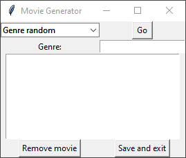

# Movie Generator

Returns a random selection based on certain parameters from movies that the user inputs.

## Table of Contents

* [General Info](#general-information)
* [Technologies Used](#technologies-used)
* [Features](#features)
* [Screenshots](#screenshots)
* [Setup](#setup)
* [Project Status](#project-status)
* [Contact](#contact)

## General Information

A user inputs info (title, genre, platform, and whether or not you have to rent it) about movies they're interested in watching, and uses specified parameters to return a random selection from said input

## Technologies Used

* Python 3.10.0
* Tkinter

## Features

* Add movie: Input title, genre, platform, rent
* True random: Returns random selection from entire pool of available movies
* Genre random: Returns random selection from pool of movies with specified genre
* Platform random: Returns random selection from pool of movies on specified platform
* Rent random: Returns random selection from pool of movies with specified rental status
* Search: Search for specific movie based on title
* Remove movie: Removes movie from available pool of movies
* Save and exit: Saves pool of movies to movies.json and closes window

## Screenshots

Genre random, platform random, rent random, and search are all pretty much the same.

## Setup

`pip install tk`

## Project Status

Project is: _finished_

## Contact

[Check out my GitHub](https://github.com/Assentt)

[Send me an Email](mailto:tubbeethan@gmail.com)
